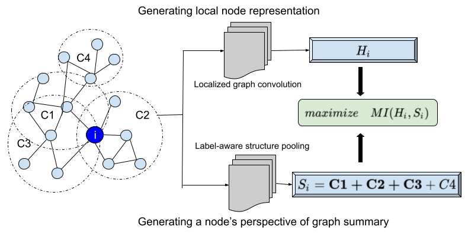

# SSDCM - Semi-Supervised Deep Learning for Multiplex Networks
This is the code necessary to run experiments on the Semi-Supervised Deep Clustered Multiplex (SSDCM) framework described in the KDD'21 paper [Semi-Supervised Deep Learning for Multiplex Networks](https://dl.acm.org/doi/abs/10.1145/3447548.3467443).

## Architecture
<p align="center">
    
</p>
In a typical InfoMax based NRL setup, the global context is modeled as a set of clusters defined on the entire graph. Each node does not have a contextual view of the graph from the perspective of the node. Instead, it has a shared global context that is identical for all the nodes, even though they may be structurally connected differently within the graph. Naively maximizing the MI of a node’s local representations with a shared global context might bias the model to encode trivial and noisy information found across all the nodes' local information. 
In this Figure, even though the example graph has many clusters, only C1, C2, C3 are relevant to node i. Therefore, the global context for node i should be more inclined towards C1,C2,C3 instead of a naive summary of all candidate clusters.

## Installation
Create a conda environment by running the following commands,
```py
conda create --name ssdcm python=3.5
conda install numpy scipy scikit-learn pandas networkx
conda install pytorch torchvision cudatoolkit=10.1 -c pytorch
```
## Dataset Preparation
Data should be stored as **dataset.pkl** file under the **data/** folder. An input dataset should be in the following format,
```js
{
  "labels": <label_matrix (binary, numpy int)>,
  "layers": {'layer_1':csr_matrix,'layer_2':csr_matrix,'layer_R':csr_matrix},
  "features": <feature_matrix (real, numpy float)>,
  "splits": {"-1": {train_idx: <array of node ids>, val_idx: <array of node ids>, test_idx: <array of node ids>}}
}
```
In the **main.py**, specify the new dataset along with its layer names within the **meta_path_dict** dictionary,
```py
meta_path_dict = {"dataset":'layer_1,layer_2,layer_3', "acm":'pap,paiap,psp,pvp,pp', "slap":'gdcdg,gdg,gg,gog,gpg,gtg', "imdbc":'MAM,MDM', "imdbl":'0,1,2',
                  "dblp":'apa,apapa,apcpa,aptpa', "flickr":'uu,utu', "amazon":"copurchase,coview,similar"}
```
Datasets used in our experiment along with train-test-validation splits are shared [Here](https://drive.google.com/drive/folders/1c9RuRk3WEiHHKoBwoZ5H2OpiG2VFR2NS?usp=sharing).

## Execution
To run Semi-Supervised Deep Clustered Multiplex, run the sample command:
```python
python main.py --dataset <dataset> --incl_attr <True/False> --reg_coef <reg_coef> --sup_coef <sup_coef> --c_assign_coef <c_assign_coef> --n_cross_nw_coef <coef_value> --l2_coef <coef_value> --lr <lr> --gpu_num <gpu_id>

Example: python main.py --dataset imdbc --incl_attr True --reg_coef 0.001 --sup_coef 0.1 --c_assign_coef 1.0 --n_cross_nw_coef 0.001 --l2_coef 0.0001 --lr 0.0005 --gpu_num 0
```

## Acknowledgements


